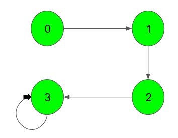
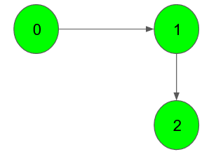

# Detect cycle in a directed graph

Given a Directed Graph with <strong>V</strong> vertices (Numbered from <strong>0</strong> to <strong>V-1</strong>) and <strong>E</strong> edges, check whether it contains any cycle or not.

<strong>Example 1:</strong>
<pre><strong>Input:</strong>

<strong>Output:</strong> 1
<strong>Explanation</strong>: 3 -&gt; 3 is a cycle</pre>

<strong>Example 2:</strong>
<pre><strong>Input:</strong>

<strong>Output:</strong> 0
<strong>Explanation</strong>: no cycle in the graph</pre>

 
<strong>Your task:</strong> 
You dont need to read input or print anything. Your task is to complete the function&nbsp;<strong>isCyclic()</strong>&nbsp;which takes the integer V denoting the number of vertices and adjacency list as input parameters and returns a boolean value denoting if the given directed graph contains a cycle or not. 

 
<strong>Expected Time Complexity:&nbsp;</strong>O(V + E) 
<strong>Expected Auxiliary Space:&nbsp;</strong>O(V)

