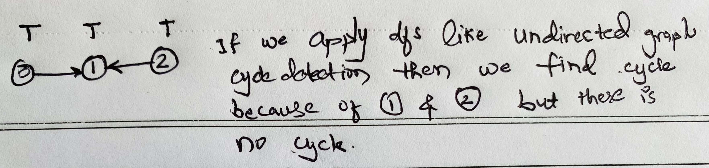

# Solution video

- [GFG Placement 100](https://practice.geeksforgeeks.org/batch/placement100-batch-2/track/DSASP-Graph/video/OTE5) This is using <strong>DFS</strong>.
- [GFG Placement 100](https://practice.geeksforgeeks.org/batch/placement100-batch-2/track/DSASP-Graph/video/MTM1Mg%3D%3D) This is using <strong>Kahn's Algorithm BFS traversal</strong>.
  
### Why we can't use same dfs as we used in Cycle detection of undirected graph
