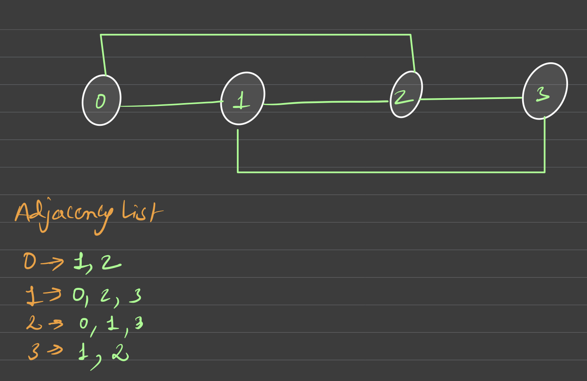

# Detect cycle in an undirected graph

Given an undirected graph with V vertices and E edges, check whether it contains any cycle or not. Graph is in the form of adjacency list where adj[i] contains all the nodes ith node is having edge with.<strong></strong>

<strong> Example 1: </strong>
