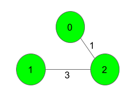

# Minimum Spanning Tree

Given a weighted, undirected and connected graph of <strong>V</strong> vertices and <strong>E</strong> edges. The task is to find the sum of weights of the edges of the&nbsp;Minimum Spanning Tree.

<pre><strong>Input:
</strong>3 3
0 1 5
1 2 3
0 2 1

<strong>Output:</strong>
4
<strong>Explanation</strong>:

The Spanning Tree resulting in a weight
of 4 is shown above.
</pre>

<strong>Expected Time Complexity:&nbsp;</strong>O(ElogV). 
<strong>Expected Auxiliary Space:&nbsp;</strong>O(V2). 
&nbsp;

