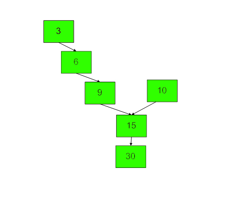

# Intersection Point in Y Shapped Linked Lists

Given two singly linked lists of size <strong>N</strong> and <strong>M, </strong>write a program to get the point where two linked lists intersect each other.

<pre><strong>Input:</strong><strong>
</strong>LinkList1 = 3-&gt;6-&gt;9-&gt;common
LinkList2 = 10-&gt;common
common = 15-&gt;30-&gt;NULL
<strong>Output: 1</strong>5
<strong>Explanation:
</strong>
</pre>

<pre><strong>Input: 
</strong>Linked List 1 = 4-&gt;1-&gt;common
Linked List 2 = 5-&gt;6-&gt;1-&gt;common
common = 8-&gt;4-&gt;5-&gt;NULL
<strong>Output: </strong>8
<strong>Explanation: </strong>

<strong>4              5</strong>
<strong>|              |</strong>
<strong>1              6
</strong><strong> \             /</strong>
<strong>  8   -----  1 </strong>
   <strong>|</strong>
   <strong>4</strong>
   <strong>|
</strong><strong>  5</strong>
<strong>  |</strong>
<strong>  NULL       </strong></pre>