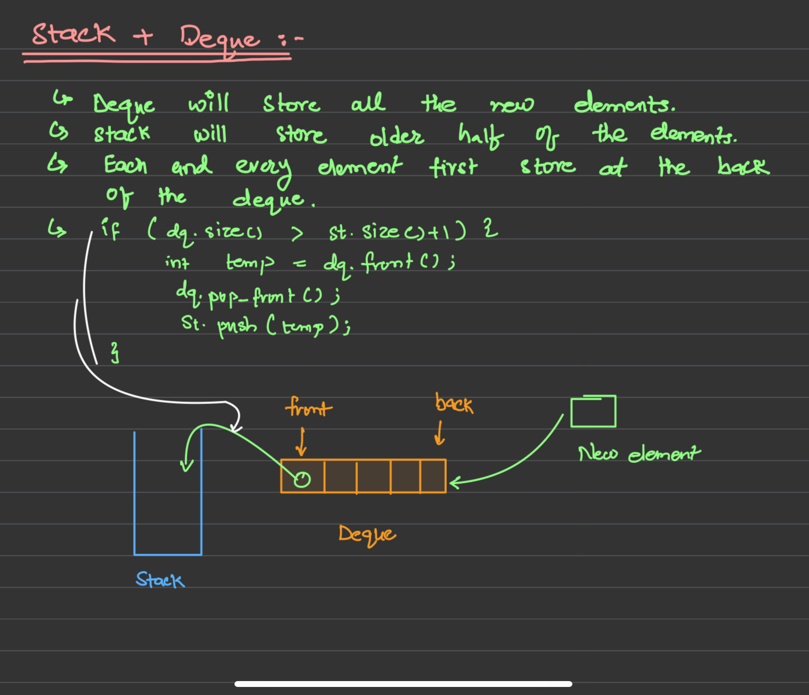

Find the middle element of a stack
===

|Type|Complexity|Solution|
|----|----------|--------|
|Doubly Linked List|Time: O(1) and Space: O(n)|[YT](https://youtu.be/ua1bPxSV_H0?si=lsfbIvB6YDKMd-cb)|
|Auxilary stack + Double Ended Queue|Time: O(1) and Space: O(n)|[GFG](https://www.geeksforgeeks.org/design-a-stack-with-find-middle-operation/)|

#### Solution for Auxilary stack + Double Ended Queue

